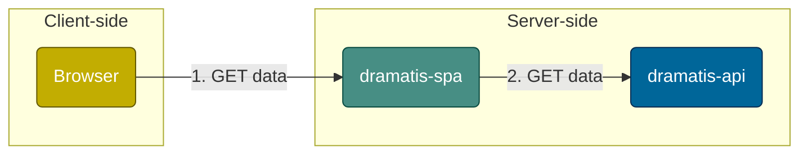

# dramatis-spa 

Single-page application (SPA) that provides listings for theatrical productions, materials, and associated data.

## Setup

- Clone this repo
- Set Node.js to version specified in `.nvmrc`, which can be achieved by running `$ nvm use` (if using [Volta](https://docs.volta.sh/guide/getting-started) then it will be set automatically)
- Install Node.js modules: `$ npm install`
- Compile code: `$ npm run build`

## To run locally

- Ensure an instance of [`dramatis-api`](https://github.com/andygout/dramatis-api) is running on `http://localhost:3000`
- Run server using `$ npm start` and visit homepage at `http://localhost:3002`

## To run linting checks

- `$ npm run lint-check`

## Architecture

